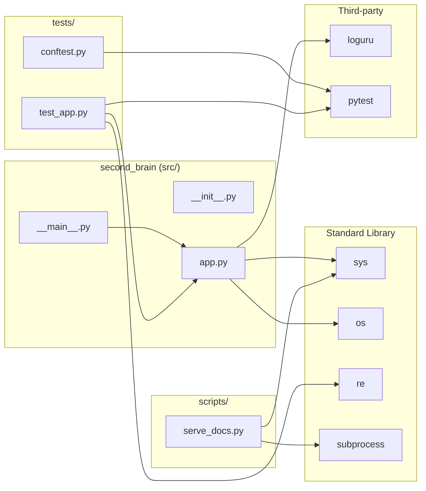

# Module Dependency Map

Import relationships across the `second_brain` project. No circular dependencies detected.

## Change-safety analysis

| Module | Safe to change? | Dependents |
|---|---|---|
| `app.py` | Carefully — it's the core | `__main__.py`, `tests/test_app.py` |
| `__main__.py` | Yes — only entry-point wiring | none |
| `__init__.py` | Yes — currently empty | none |
| `tests/conftest.py` | Yes — only pytest fixtures | none outside tests |
| `tests/test_app.py` | Yes — leaf node | none |
| `scripts/serve_docs.py` | Yes — standalone script | none |

**No circular dependencies detected.**
